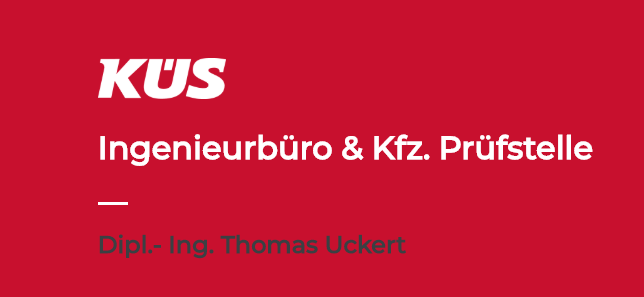

This is a small business homepage for a local Engineer
---



The website is designed and built as contact and services page for a small local business owner.

Access this page
---

You can visit this page live at [this adress](https://kues-brb.de) or showcase it locally when you have access to a HTTP Server. This, for example, is done in python2x via the Simple HTTP Server feature.

**Step 1** - Change directory to this cloned repository

**Step 2** - Run Python Command for launching a simple HTTP Server
```python
python -m SimpleHTTPServer
```

**Step 3** - Access via ```0.0.0.0:8000``` in your local webbrowser and open up the ```index.html``` File.

Quick Overview
---

This page is designed with simplicity in mind, so its build nearly on HTML & CSS only. This page is build up from scratch without any toolbox or bootstrap.
A few simple Java Script lines are used for creating a "hamburger" styled side menu inspired by some work I've seen from [Adrian Gyuricska](https://github.com/AdrianGyuricska).
